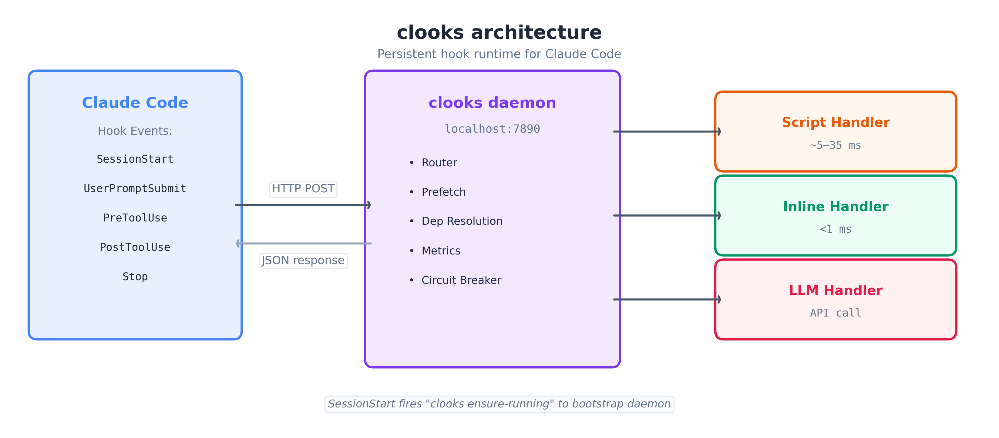

# clooks

Persistent hook runtime for Claude Code. Eliminate cold starts. Get observability.

[](https://www.npmjs.com/package/@mauribadnights/clooks)
[](LICENSE)

**[Documentation](https://mauribadnights.github.io/clooks/)**

## Performance

| Metric | Without clooks | With clooks | Improvement |
|--------|---------------|-------------|-------------|
| Single hook invocation | ~34.6ms | ~0.31ms | **112x faster** |
| Full session (120 invocations) | ~3,986ms | ~23ms | **99% time saved** |
| 5 parallel handlers | ~424ms | ~96ms | **4.4x faster** |

> Benchmarked on Apple Silicon (M-series), Node v24.4.1. Run `npm run bench` to reproduce.

## Installation

```bash
npm install -g @mauribadnights/clooks
clooks migrate    # migrates existing hooks, installs system service, installs clooks agent
clooks start
```

`clooks migrate` converts your `settings.json` command hooks into HTTP hooks backed by the daemon, auto-installs a system service (launchd/systemd) for auto-start and crash recovery, and installs the `clooks` expert agent (`claude --agent clooks`). Starting fresh instead? Use `clooks init` to create a blank manifest.

## How It Works



One persistent HTTP server replaces per-invocation process spawning. Claude Code POSTs hook events to the daemon, which dispatches to handlers defined in `~/.clooks/manifest.yaml`. Handlers that fail 3 times consecutively are auto-disabled.

## Quick Reference -- Commands

**Daemon lifecycle:**

| Command | Description |
|---------|-------------|
| `clooks start` | Start the daemon (`-f` foreground, `--no-watch` disable manifest watching) |
| `clooks stop` | Stop the daemon |
| `clooks status` | Show daemon status, uptime, handler count, service state |
| `clooks ensure-running` | Start daemon if not running (used internally by SessionStart hook) |

**Observability:**

| Command | Description |
|---------|-------------|
| `clooks stats` | Interactive TUI for execution metrics (`-t` for plain text) |
| `clooks costs` | LLM token usage and cost breakdown |
| `clooks doctor` | Run diagnostic health checks |

**Configuration:**

| Command | Description |
|---------|-------------|
| `clooks migrate` | Convert `settings.json` command hooks to HTTP hooks, install service + agent |
| `clooks restore` | Restore original `settings.json` from backup |
| `clooks sync` | Sync `settings.json` with manifest (add missing HTTP hook entries) |
| `clooks init` | Create default config directory and example manifest |
| `clooks update` | Update clooks to latest version and refresh agent |
| `clooks rotate-token` | Generate new auth token, update manifest + settings.json, hot-reload daemon |

**Plugins:**

| Command | Description |
|---------|-------------|
| `clooks add <path>` | Install a plugin from a local directory |
| `clooks remove <name>` | Uninstall a plugin and its contributed handlers |
| `clooks plugins` | List installed plugins and their handlers |

**System service:**

| Command | Description |
|---------|-------------|
| `clooks service install` | Install as system service (auto-start on login, auto-restart on crash) |
| `clooks service uninstall` | Remove system service |
| `clooks service status` | Show service status |

## Configuration -- Manifest

Handlers are defined in `~/.clooks/manifest.yaml`:

```yaml
# Pre-fetch shared context once per event, available as $VARIABLES in LLM prompts
prefetch:
  - transcript        # last 50KB of session transcript
  - git_status        # git status --porcelain
  - git_diff          # git diff --stat (max 20KB)

handlers:
  PreToolUse:
    # Script handler -- spawns a shell command
    - id: safety-guard
      type: script
      command: node ~/hooks/guard.js
      filter: "Bash|Execute|!Read"      # OR logic, ! negates
      project: "*/my-project/*"         # only fire in matching cwd
      timeout: 3000
      enabled: true

    # LLM handler -- calls Anthropic Messages API
    - id: code-review
      type: llm
      model: claude-haiku-4-5
      prompt: "Review this $TOOL_NAME call: $ARGUMENTS"
      batchGroup: analysis              # batched with other handlers in same group
      maxTokens: 512
      temperature: 0.5
      depends: [safety-guard]           # waits for safety-guard to complete first

    # Another LLM handler in the same batch group -- one API call for both
    - id: security-check
      type: llm
      model: claude-haiku-4-5
      prompt: "Check for security issues in $TOOL_NAME: $ARGUMENTS"
      batchGroup: analysis
      agent: "builder"                  # only fire in builder agent sessions

  UserPromptSubmit:
    # Inline handler -- imports a JS module in-process (no subprocess)
    - id: prompt-logger
      type: inline
      module: ~/.clooks/handlers/logger.js
      async: true                       # fire-and-forget, doesn't block response
      sessionIsolation: true            # reset state on SessionStart

  Stop:
    - id: session-summary
      type: llm
      model: claude-haiku-4-5
      prompt: "Summarize this session:\n$TRANSCRIPT\n\nGit changes:\n$GIT_DIFF"

settings:
  port: 7890
  logLevel: info                        # debug | info | warn | error
  authToken: your-token-here            # auto-generated by migrate/init
  # anthropicApiKey: sk-...             # or set ANTHROPIC_API_KEY env var
```

## Handler Types

| Type | Overhead | Language | Use case |
|------|----------|----------|----------|
| `script` | ~5-35ms (subprocess) | Any (shell command) | Existing scripts, non-JS tools |
| `inline` | <1ms (in-process) | JavaScript/TypeScript | Performance-critical handlers |
| `llm` | Network-bound | Prompt template | AI-powered analysis, review, summarization |

**script** -- runs `sh -c "command"`, pipes hook JSON to stdin, reads JSON from stdout.

**inline** -- imports a JS module and calls its default export. No subprocess overhead.

**llm** -- calls Anthropic Messages API with `$VARIABLE` interpolation. Supports batching and cost tracking.

## Handler Fields Reference

| Field | Type | Default | Applies to | Description |
|-------|------|---------|------------|-------------|
| `id` | string | required | all | Unique handler identifier |
| `type` | string | required | all | `script`, `inline`, or `llm` |
| `command` | string | required | script | Shell command to execute |
| `module` | string | required | inline | Path to JS module with default export |
| `model` | string | required | llm | `claude-haiku-4-5`, `claude-sonnet-4-6`, or `claude-opus-4-6` |
| `prompt` | string | required | llm | Prompt template with `$VARIABLE` interpolation |
| `filter` | string | -- | all | Keyword filter (see Filtering) |
| `project` | string | -- | all | Glob pattern matched against cwd |
| `agent` | string | -- | all | Only fire when session agent matches |
| `async` | boolean | `false` | all | Fire-and-forget, don't block response |
| `depends` | string[] | -- | all | Handler IDs to wait for before executing |
| `sessionIsolation` | boolean | `false` | all | Reset handler state on SessionStart |
| `batchGroup` | string | -- | llm | Group ID for batching into one API call |
| `maxTokens` | number | `1024` | llm | Maximum output tokens |
| `temperature` | number | `1.0` | llm | Sampling temperature |
| `timeout` | number | `5000`/`30000` | all | Timeout in ms (5s default, 30s for llm) |
| `enabled` | boolean | `true` | all | Disable without removing |

## Scoped Execution

Handlers can be scoped to specific projects or agents:

```yaml
- id: driffusion-lint
  type: script
  command: node ~/hooks/lint.js
  project: "*/Driffusion/*"     # only fires when cwd matches this glob

- id: builder-guard
  type: inline
  module: ~/hooks/guard.js
  agent: "builder"              # only fires in builder agent sessions
```

Both fields are optional. When omitted, the handler fires for all projects/agents.

## Filtering

The `filter` field skips handlers based on keywords matched against the full JSON-serialized hook input (case-insensitive):

```
filter: "word1|word2"       # run if input contains word1 OR word2
filter: "!word"             # run unless input contains word
filter: "word1|!word2"     # run if word1 present AND word2 absent
```

```yaml
- id: bash-guard
  type: script
  command: node ~/hooks/guard.js
  filter: "Bash|Execute|!Read"   # runs for Bash/Execute tools, never for Read
```

## LLM Handlers

**Setup:**

```bash
npm install @anthropic-ai/sdk    # peer dependency, required only for llm handlers
export ANTHROPIC_API_KEY=sk-...  # or set in manifest: settings.anthropicApiKey
```

**Prompt template variables:**

| Variable | Source | Description |
|----------|--------|-------------|
| `$TRANSCRIPT` | Pre-fetched transcript file | Last 50KB of session transcript |
| `$GIT_STATUS` | `git status --porcelain` | Current working tree status |
| `$GIT_DIFF` | `git diff --stat` | Changed files summary (max 20KB) |
| `$ARGUMENTS` | `hook_input.tool_input` | JSON-stringified tool arguments |
| `$TOOL_NAME` | `hook_input.tool_name` | Name of the tool being called |
| `$PROMPT` | `hook_input.prompt` | User's prompt (UserPromptSubmit only) |
| `$CWD` | `hook_input.cwd` | Current working directory |

`$TRANSCRIPT`, `$GIT_STATUS`, and `$GIT_DIFF` require the corresponding key in `prefetch`. The others are always available from the hook input.

**Batching:** Handlers sharing a `batchGroup` on the same event are combined into a single API call. Three Haiku calls become one, saving ~2/3 of input token cost and eliminating two round-trips. Batch groups are scoped per session to prevent cross-session contamination.

## Async Handlers

Handlers with `async: true` execute fire-and-forget -- they run in the background and do not block Claude's response. Use this for logging, analytics, or any work that does not need to inject context back into the session.

```yaml
- id: session-tracker
  type: inline
  module: ~/hooks/tracker.js
  async: true
```

## Dependency Resolution

Handlers can declare dependencies with `depends`. clooks resolves them into topological execution waves -- handlers in the same wave run in parallel, waves execute sequentially.

```yaml
- id: context-loader
  type: inline
  module: ~/hooks/context.js

- id: security-check
  type: llm
  model: claude-haiku-4-5
  prompt: "Check $TOOL_NAME given context: $CONTEXT"
  depends: [context-loader]    # runs in wave 2, after context-loader completes in wave 1
```

## Pre-fetch

Fetch shared context once per hook event and make it available to all handlers via `$VARIABLE` interpolation in LLM prompts.

| Key | Source | Max size | Description |
|-----|--------|----------|-------------|
| `transcript` | `transcript_path` file | 50KB (tail) | Session conversation history |
| `git_status` | `git status --porcelain` | unbounded | Working tree status |
| `git_diff` | `git diff --stat` | 20KB | Changed files summary |

Pre-fetched data is cached for the duration of a single event dispatch. Errors on individual keys are silently caught -- a failed `git_status` does not prevent `transcript` from loading.

## Observability

**Execution metrics** -- `clooks stats` launches an interactive TUI by default. Use `-t` for plain text (also auto-selected when piped):

```
$ clooks stats -t

Event               Fires     Errors    Avg (ms)    Min (ms)    Max (ms)
------------------------------------------------------------------------
PreToolUse          47        0         1.2         0.8         3.1
Stop                12        0         2.4         1.1         5.6
UserPromptSubmit    12        1         1.8         0.9         4.2

Total fires: 71 | Total errors: 1 | Spawns saved: ~71
```

**Diagnostics** -- `clooks doctor` runs health checks on daemon, port, manifest, settings, and handler state:

```
$ clooks doctor

[pass] Daemon is running (PID 44721, uptime 2h 13m)
[pass] Port 7890 is responding
[pass] Manifest loaded: 4 handlers across 3 events
[pass] settings.json has HTTP hooks pointing to clooks
[pass] No handlers in circuit-breaker state
[warn] 1 handler error in last 24h (session-logger on Stop)
```

**Cost tracking** -- `clooks costs` shows LLM token usage and spend per handler and model:

```
$ clooks costs

LLM Cost Summary
  Total: $0.0142 (4,280 tokens)

  By Model:
    claude-haiku-4-5       $0.0142 (4,280 tokens)

  By Handler:
    code-review            $0.0089 (12 calls, avg 178 tokens)
    security-check         $0.0053 (12 calls, avg 178 tokens)
```

Built-in pricing (per million tokens): Haiku ($0.80 / $4.00), Sonnet ($3.00 / $15.00), Opus ($15.00 / $75.00). Costs persist to `~/.clooks/costs.jsonl`.

## System Service

`clooks service install` creates a platform-native service (launchd on macOS, systemd on Linux) that starts the daemon on login and restarts it on crash. `clooks migrate` and `clooks init` install the service automatically. Use `clooks service status` to check and `clooks service uninstall` to remove.

## Plugin Development

Plugins package reusable sets of handlers. A plugin is any directory with a `clooks-plugin.yaml`:

```yaml
# clooks-plugin.yaml
name: my-security-suite
version: 1.0.0
description: Security guards for tool calls
author: your-name

handlers:
  PreToolUse:
    - id: bash-guard
      type: inline
      module: $PLUGIN_DIR/handlers/bash-guard.js    # $PLUGIN_DIR resolves to plugin install path
      timeout: 3000
    - id: file-guard
      type: inline
      module: $PLUGIN_DIR/handlers/file-guard.js
      timeout: 2000

prefetch:
  - git_status

extras:
  skills: [security-audit]       # skill names this plugin provides
  agents: [security-reviewer]    # agent names this plugin provides
  readme: README.md              # path to plugin README (relative to plugin dir)
```

**Installing and managing plugins:**

```bash
clooks add ./my-security-suite     # install from local path
clooks remove my-security-suite    # uninstall
clooks plugins                     # list installed plugins + handlers
```

Handler IDs are automatically namespaced to the plugin (`my-security-suite/bash-guard`) to avoid collisions with user-defined handlers or other plugins.

## Expert Agent

clooks ships with an expert agent that understands the full architecture, configuration, and troubleshooting workflow. It is auto-installed and auto-updated by `clooks migrate`, `clooks init`, and `clooks update`. Invoke it with `claude --agent clooks`.

## Short-Circuit Chains

When a `PreToolUse` handler returns a deny decision, clooks automatically skips the corresponding `PostToolUse` handlers for that tool call. Deny results are cached with a 30-second TTL, so repeated calls to the same tool with the same arguments short-circuit without re-evaluating handlers.

## Configuration Reference

| Item | Path / Value |
|------|-------------|
| Port | `7890` (default) |
| Config directory | `~/.clooks/` |
| Manifest | `~/.clooks/manifest.yaml` |
| Metrics | `~/.clooks/metrics.jsonl` |
| Costs | `~/.clooks/costs.jsonl` |
| Daemon log | `~/.clooks/daemon.log` |
| PID file | `~/.clooks/daemon.pid` |
| Plugins directory | `~/.clooks/plugins/` |

## Contributing

### Setup

```bash
git clone https://github.com/mauribadnights/clooks.git
cd clooks
npm install
```

### Codebase layout

```
src/
  cli.ts          Command definitions (commander)
  server.ts       HTTP daemon — hook routing, auth, session management
  handlers.ts     Handler execution engine (script, inline, LLM)
  manifest.ts     Manifest loading and validation
  metrics.ts      Metrics collection and aggregation
  tui.ts          Interactive terminal dashboard (ANSI-based)
  llm.ts          Anthropic API integration and batching
  filter.ts       Keyword filter engine
  prefetch.ts     Pre-fetch context (transcript, git status/diff)
  plugin.ts       Plugin install/remove/list
  ...

tests/            Mirrors src/ — one test file per module
benchmarks/       Performance benchmarks
docs/             Architecture diagram and assets
hooks/            Built-in hook scripts
agents/           Built-in agent definitions
```

### Development workflow

```bash
npm run build       # Compile TypeScript to dist/
npm test            # Run all tests (vitest)
npm run test:watch  # Watch mode
npm run bench       # Run performance benchmarks
npx tsc --noEmit    # Type-check without emitting
```

### Pull request guidelines

1. Fork the repo and create a feature branch from `main`
2. Write tests for new functionality — tests are required for all PRs
3. Ensure `npm test` passes and `npx tsc --noEmit` reports zero errors
4. Write a clear PR description explaining **what** changed and **why**
5. Keep PRs focused — one feature or fix per PR

### Bug reports and feature requests

Open an issue at [github.com/mauribadnights/clooks/issues](https://github.com/mauribadnights/clooks/issues) with reproduction steps for bugs or a use-case description for features.

## License

MIT
